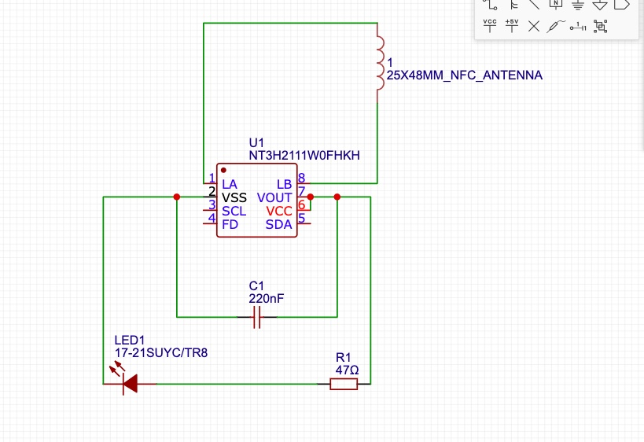
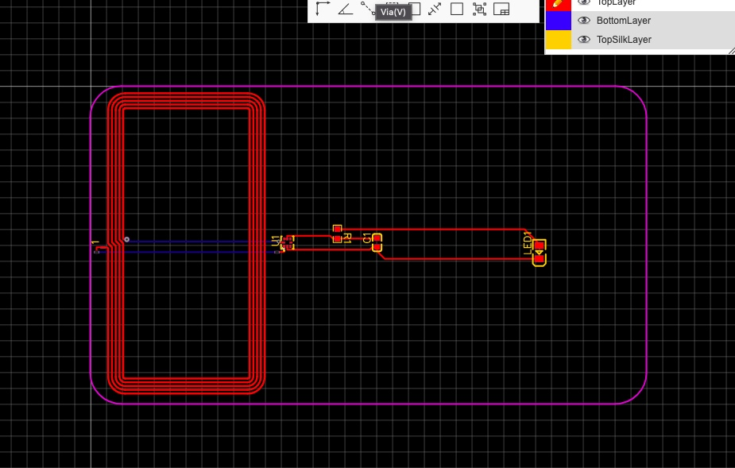
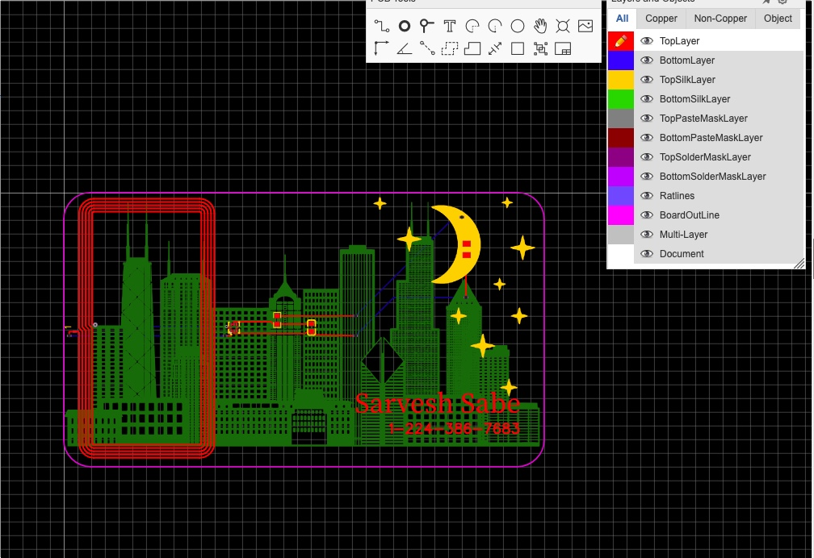

# July 28th: Pcb schematics!

I started a new project in EasyEDA! Browsed components and placed them in the schematic. Wired everything up and now the schematics should be done! When following the instructions I didn't know they used EasyEDA STD and I was using EasyEDA PRO. so I got very confused and I couldn't find the antenna, so I switched over to EasyEDA STD. I will now make start designing the pcb.

**Total time spent: 0.8h**

# July 28th: Pcb making!

I worked on making the actual PCB card and wiring the components together! I spent a lot of time trying to use auto route but there were some connections it couldn't make so I had to manually route them. I plan to personalize the PCB card now!!

**Total time spent: 1h**

# July 29th: Personalizing the PCB card!

I Personalized the PCB card!!! I added a moon that will light up and stars on the top silk layer. I also added my name and phone number. On the bottom silk layer I have the Chicago skyline!!! I had to move the lighting around so that it can light the moon up and so I had to rewire some of the components. I finished!!!

**Total time spent: 1.5h**